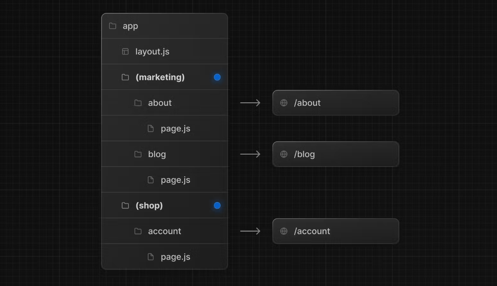

# App Router

- Page Router から変わって導入された
- app 直下の page.tsx がルーティング対象
- layout.tsx は page.tsx を自動でラップできる
- 特殊なディレクトリ
  1. 論理グループ
  - ディレクトリ名を()で囲うと、ルーティングパスに影響されなくなる機能
    

### layout と template

- layout

  - 複数のページに渡って共有される UI
  - 特徴としては画面遷移が行われた際に、その状態を保持し、再レンダリングは行われません
  - Layout はネスト（入れ子）にして使用することも可能

- template
  - 子レイアウトやページをラップ
  - Template は各ページ遷移ごとに新しいステートを生成
  - Template を適用した複数のページ間を移動する際に、新しい DOM 要素が生成され、ステートやエフェクトは再同期
