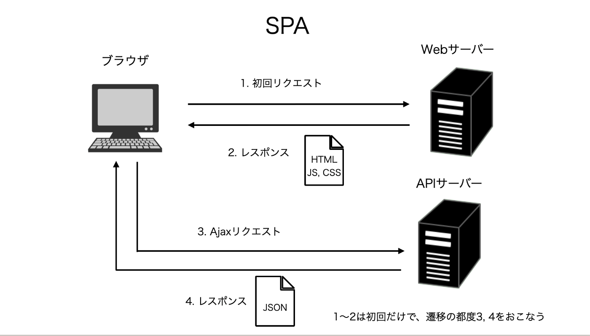

# SPA とは

- Single Page Application の略称
- 最初に、HTML, CSS, JS などの必要な assets を Web サーバーから取得し、その内の JS をもとに具体的な UI を描画し、またページ遷移の際の UI の変化も、JS をもとに再描画を行うアーキテクチャ
- 基本的には初回のみとなっており、2 回目以降は API からデータを受け取ることで差分箇所のみ都度置き換え

## メリット

- ページ遷移を、サーバーにリクエストを送らないため速やかに実行できるようになり、ユーザーの体験がより向上

## デメリット

- 初回のローディングが長い
- SEO 問題
  - index.html に情報量が多いから？
