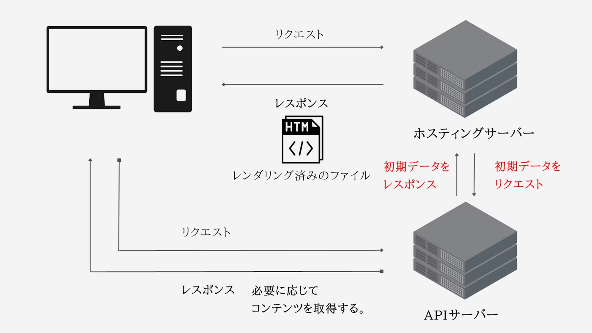

# SSR とは

- Server Side Rendering の略
- ページ遷移のたびサーバーに HTTP リクエストが走り、サーバー側で API と連携され生成された HTML をブラウザに返すアーキテクチャ
- サーバー側で HTML を生成して返す

# メリット

- 初回のレンダリング速度の改善
- SEO に対応

# MPA との違い

- 一度目はサーバーサイドそれ以外は JavaScript のフレームワークがブラウザ内で行う

# 参考サイト

- https://qiita.com/manabito76/items/fe91eefe11a74dcf5126
