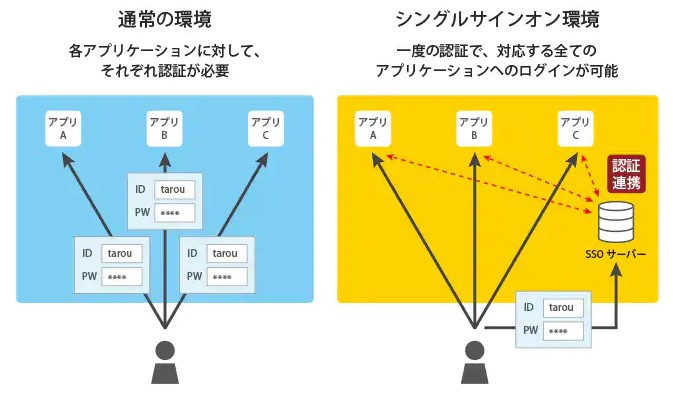

## 最小権限の原則

- 対象が本来の目的を遂行するのに必要となる最小限の権限のみを与え、他の挙動を禁じる運用方針

## 認証認可

- 権限設定で知っておくべきなのは「認証」と「認可」とを分離して扱う考え方
  - 「認証」は「誰か」を判別
  - 「認可」は「どこまでを許可するか」を判別

## シングルサインオン(SSO)

- SSO とは複数のシステムのパスワード管理を一つにしてくれるもの
- 複数の鍵（パスワードなど）を管理するよりも一つの鍵を管理するだけの方がセキュリティリスクが低くなる
- セキュリティ対策は面倒というイメージがあると思いますが、SSO は運用効率が高まり且つセキュリティリスク低減につながる施策
- Active Directory（Windows）がよく知られる SSO の実装技術
  
